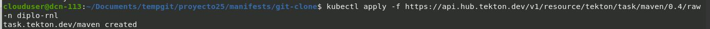
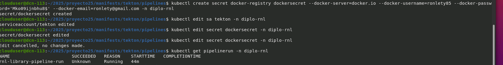
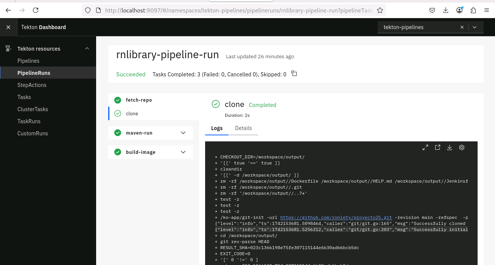

###Pasos para el despliegue de una aplicación Java con Tekton  

##Tekton  

Esta herramienta opensource nos permite crear sistemas CI/CD, a través de GitHub en este ejemplo, nos pemite crear componentes YAML que pueden construit, clonar y desplegar aplicaciones usando nuestra infraestructura, en este caso el laboratorio de DGTIC. 
## Instalación de  Tekton  
Tekton ya tiene componentes que se pueden instalar y usar facilmente, hemos usado _**steps**_ , _**Tasks***_  
Cada tarea ejecutada crea un pod. Para instalar una tarea conformada por etapas que hemos de ejecutar:  
 ' #kubectl apply -f  https://storage.googleapis.com/tekton-releases/pipelines/latest/release.yaml '  

### Pasos para el despliegue de una aplicación Java con Tekton  
#Tekton  
Esta herramienta opensource nos permite crear sistemas CI/CD, a través de GitHub en este ejemplo, nos pemite crear componentes YAML que pueden construit, clonar y desplegar aplicaciones usando nuestra infraestructura, en este caso el laboratorio de DGTIC.  
## Instalación de componentes tasks de Tekton  
Tekton ya tiene componentes que se pueden instalar y usar facilmente, hemos usado _**steps**_ , _**Tasks***_  
Cada tarea ejecutada crea un pod. Para instalar una tarea conformada por etapas que hemos de ejecutar:  
'  #kubectl create -f https://api.hub,tekton.dev/v1/resource/tekton/git-clone/0.9/raw -n diplo-rnl '  
### Clonando desde repositorio Git   
Para clonar el código desde nuestro repositorio, se utilizo el archivo yaml  
[TaskRun.yaml](manifests/git-clone/TaskRun.yaml)  
Se ejecuta con el comando:  
' #kubectl create -f TaskRun.yaml -n diplo-rnl '  
Se valida que se hay ejecutado correstamente  
' #kubectl get taskrun -n diplo-rnl '  
Si hubiera algun problema puedes detallar las bitácoras  
' #kubectl describe taskrun -n diplo-rnl '  
Construyendo la imagen de la aplicación  

Una vez clonada, se utiliza la tarea maven que ofrece tekton  
[maven tekton](https://hub.tekton.dev/task/maven)
Se utilizo el archivo [mvn.yaml](manifest/git-clone/mvn-yaml) para ejecutar la tarea previamente instalada. 
  
Se valida la correcta ejecuión con del comando  
' #kubectl get task -n diplo-rnl '  
  
' #kubectl create -f https://api.hub,tekton.dev/v1/resource/tekton/git-clone/0.9/raw -n diplo-rnl '  
### Clonando desde repositorio Git   
Para clonar el código desde nuestro repositorio, se utilizo el archivo yaml  
[TaskRun.yaml](manifests/git-clone/TaskRun.yaml)  
Se ejecuta con el comando:  
' #kubectl create -f TaskRun.yaml -n diplo-rnl '  
Se valida que se hay ejecutado correstamente  
' #kubectl get taskrun -n diplo-rnl '  
Si hubiera algun problema puedes detallar las bitácoras  
' #kubectl describe taskrun -n diplo-rnl '  
Construyendo la imagen de la aplicación  

Una vez clonada, se utiliza la tarea maven que ofrece tekton,  
[maven tekton](https://hub.tekton.dev/task/maven)  
Se utilizo el archivo [mvn.yaml](manifest/git-clone/mvn-yaml) para ejecutar la tarea previamente instalada.  
  
Se valida la correcta ejecuión con del comando  
' #kubectl get task -n diplo-rnl '  
  
### Colocando la imagen en el repositorio de Docker  

Para poder colocar la imagen compilada previamente es necesario crear un secret con los datos de conexion al repositorio de docker

'#kubectl create secret docker-registry dockersecret --docker-server=docker.io --docker-username=ronlety85 --docker-password='XXX' --docker-email=ronlety@gmail.com -n '  
  

### validando la ejecucion del pipeline  
Una vez que ya tenemos los artefactos creados, las tareas ejecutandose y validadas.  
YA creado el secrets para acceso al repositorio, ejecutamos el pipeline y validamos su ejecucion.  
 >br>

'

